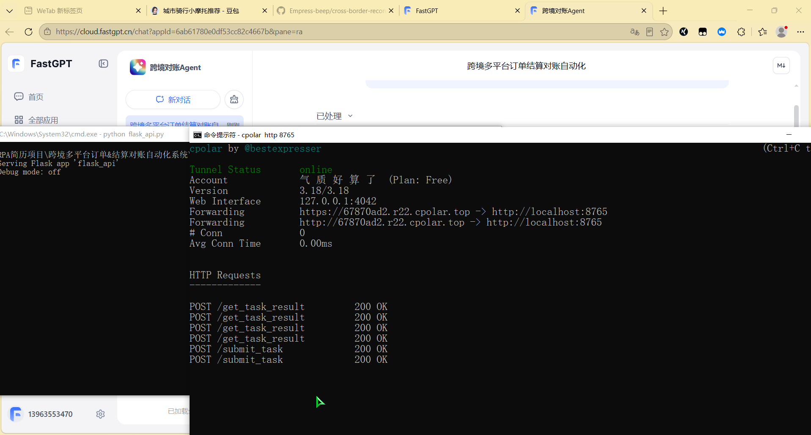
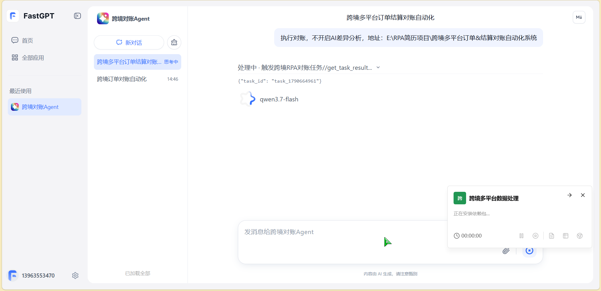
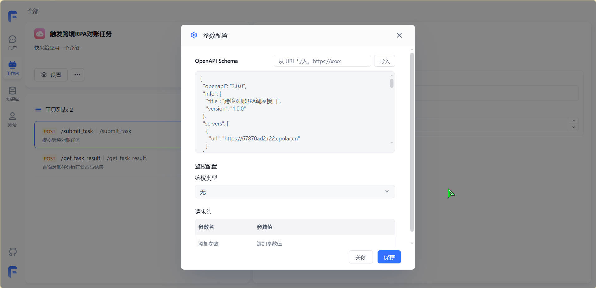
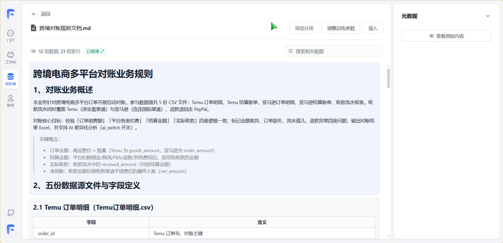
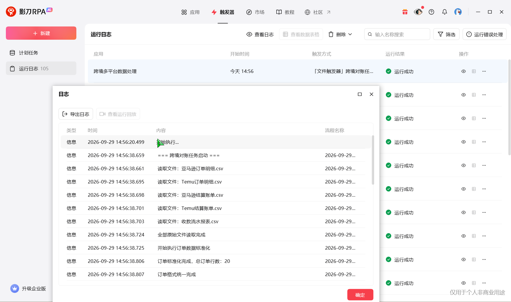
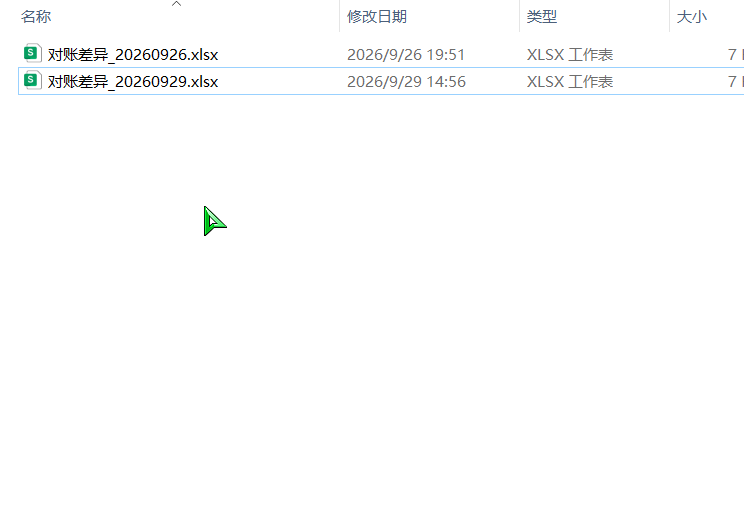

# 跨境多平台订单&结算对账自动化系统

> FastGPT‑Agent + Flask中转 + 影刀RPA 实现跨境电商智能对账闭环Demo项目

## 📖 项目简介
针对跨境电商Temu、亚马逊平台订单与结算账单人工对账效率低、差异核对繁琐问题，搭建一套**大模型Agent驱动的自动化对账系统**。
通过FastGPT构建RAG知识库，导入对账业务规则文档；Agent接收用户对账指令，调用Flask接口生成任务中转文件；影刀RPA监听中转目录，读取订单、结算CSV数据执行对账逻辑，输出对账差异Excel；执行完成回写任务状态，Agent读取执行结果并反馈给用户，完成端到端全流程自动化。

本项目为本地演示Demo，完整链路可本机复现运行。

## 🛠 技术栈
- **大模型Agent&RAG**：FastGPT、提示词工程、向量知识库检索
- **后端中转服务**：Python Flask，实现Agent与RPA之间任务通信
- **RPA自动化**：影刀RPA（社区免费版），可视化流程 + Python混合开发
- **数据处理**：Pandas，订单/结算账单读取、清洗、比对、差异输出
- **内网穿透**：Cpolar，用于本地Flask服务被云端FastGPT访问
- **数据源**：Temu、亚马逊模拟订单明细、结算账单CSV模拟业务数据

## 📁 项目目录结构

跨境多平台订单 & 结算对账自动化系统

├─core/                # 影刀 RPA 配套 Python 业务模块

│   ├─config.py          # 路径、日志、千问 API 配置

│   └─cross_check.py     # 订单‑结算对账核心比对逻辑

├─flask_api/             # Flask 中转服务

│   └─app.py             # 接收 Agent 下发任务、查询任务状态接口

├─rag_knowledge/         # RAG 知识库文档

│   └─对账规则文档.md    # 字段映射、校验逻辑、业务规则

├─demo_data/             # 模拟业务测试 csv 数据

├─docs/                  # 项目截图、演示文档

└─README.md

> ⚠️ 重要说明
> 1. 影刀RPA**社区免费版不支持导出独立工程文件(.xprj/.flow)**，可视化拖拽流程源码无法导出分发。仓库仅归档配套Python业务脚本，可视化流程需要在本机影刀客户端打开项目查看与运行。
> 2. 代码内Windows绝对路径为本机演示路径，部署前务必修改为自己电脑实际路径。
> 3. 千问API‑Key不硬编码写在源码，从系统环境变量读取，不要将明文密钥提交至仓库。

## 🔄 整体业务流程
1. 用户在FastGPT Agent对话窗口下发对账指令；
2. Agent检索RAG对账规则知识库，组装任务参数，调用Flask `submit_task`接口；
3. Flask接收请求，生成`task_xxx.json`任务中转文件，写入全局中转目录；
4. 影刀RPA监听中转文件夹，读取任务文件，获取业务数据存放路径；
5. RPA调用对账Python模块，读取订单、结算CSV执行交叉对账，输出差异Excel；
6. 无论成功/失败，影刀写入`task_xxx_result.json`任务结果状态文件；
7. Agent轮询调用Flask `get_task_result`查询接口，读取任务执行状态；
8. Agent整理对账结果、差异文件路径反馈给前端用户，整套闭环完成。

## ✨ 项目亮点
1. **Agent与RPA解耦架构**：通过文件中转模式实现大模型Agent与本地RPA流程通信，规避云端Agent直接读写本地文件的限制；
2. **RAG知识库驱动业务规则**：对账规则全部维护在知识库文档，业务变更只修改文档，无需改动代码；
3. **完整异步任务闭环**：任务成功、失败均回写状态，Agent可以感知RPA执行结果，不是单向简单下发任务；
4. **混合开发模式**：复杂数据比对使用Python Pandas实现，流程调度、文件监听使用影刀可视化组件，兼顾开发效率与可读性；
5. **容错与熔断机制**：路径判空、日志持久化、AI接口失败熔断器，防止连续调用异常；区分订单未结算、退款、金额差异、回款差异多种业务场景。

## 🚀 本地运行前置条件
1. Python3.10+，安装依赖
```bash
pip install flask pandas openpyxl dashscope


```

2.本地安装影刀 RPA 客户端，导入对应应用

3.Cpolar 内网穿透工具，映射 Flask 8765 端口，提供 HTTPS 公网地址，用于 FastGPT 插件调用本地接口

4.FastGPT 平台：创建 Agent，导入对账规则知识库，配置 OpenAPI 插件（submit_task、get_task_result两个接口）

5.设置环境变量 DASHSCOPE_API_KEY，填入阿里云千问 API‑Key

## 📝 启动步骤

1. 修改 `flask_api/app.py`、`rpa_py/config.py` 中本地目录配置，路径与影刀读取路径保持一致；
2. 启动 Flask 服务

```cmd
cd flask_api
python app.py
```

3.启动 Cpolar 内网穿透，映射 8765 端口，获取公网 HTTPS 地址；

4.将 Cpolar 公网地址填入 FastGPT OpenAPI 插件配置；

5.启动影刀 RPA 应用，开启文件夹文件触发器监听；

6.在 FastGPT 对话窗口下发对账任务，观察整套链路执行；

7.执行完毕查看 output 目录对账差异 Excel 文件。

## 📸项目演示截图

1.cpolar 内网穿透 + Flask 中转接口请求日志



2.FastGPT Agent 对话交互，对账任务完成输出结果




3.FastGPT OpenAPI 工具参数配置



4.FastGPT RAG 对账业务规则知识库



5.影刀 RPA 流程触发器运行日志



6.对账差异 Excel 输出产物



## 📌 已知限制与注意事项

1. 影刀社区免费版限制，无法导出可视化流程工程，仅本机客户端可完整复现；
2. Cpolar 免费版隧道域名每次重启会变化，修改后需要同步更新 FastGPT 插件配置；
3. 本项目为 Demo 演示项目，未做高并发处理，适合单任务调试演示；
4. 代码路径默认为 Windows 格式，Linux/macOS 需要修改路径分隔符；
5. log、task、output、archive 目录为运行时生成，不要提交到版本库，已在 gitignore 过滤。

## 📃项目输出产物

- 对账差异 Excel：`订单结算差异`、`结算回款差异`两个 sheet，记录不匹配异常数据
- 运行日志：Flask 服务日志 + RPA 业务运行日志
- task/*.json：任务、结果中转状态文件
